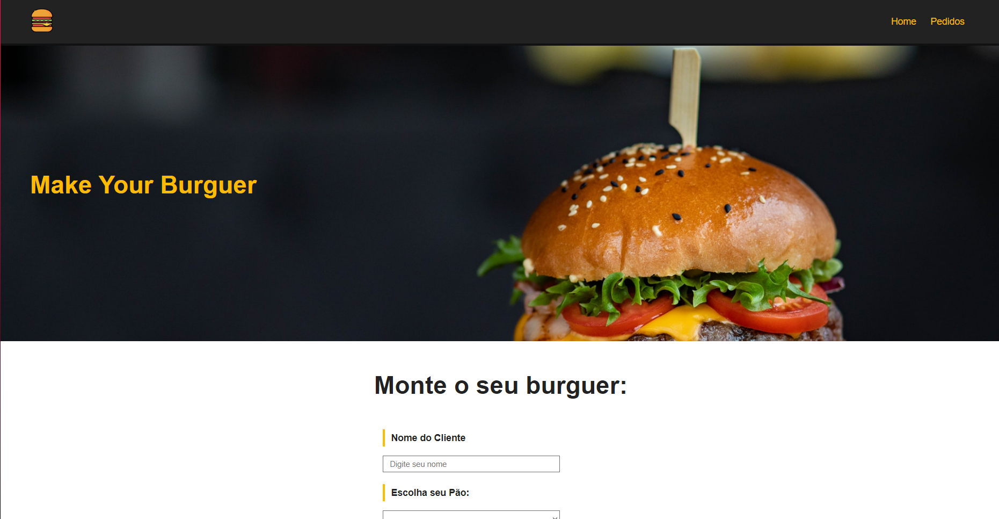
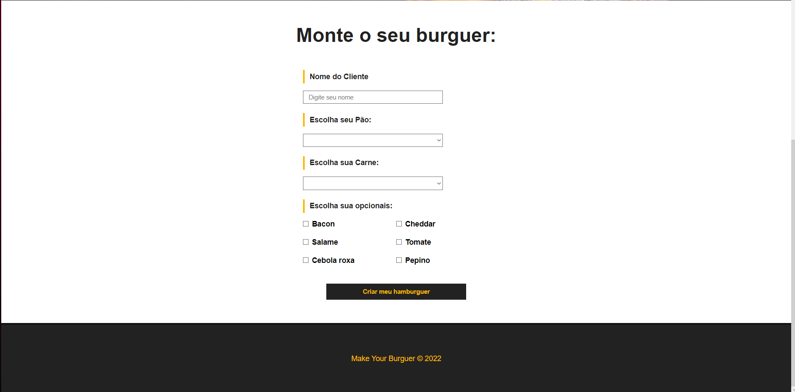

# learningVue

I did this project for learning about vuejs. star pls <3

### This is a simple project but it's nice to learn vuejs

I did one website who you can order your hamburguer, it's so funny!

### I have some site pics, lets see

### It's nice, and verry funny VueJS!

see you soon
